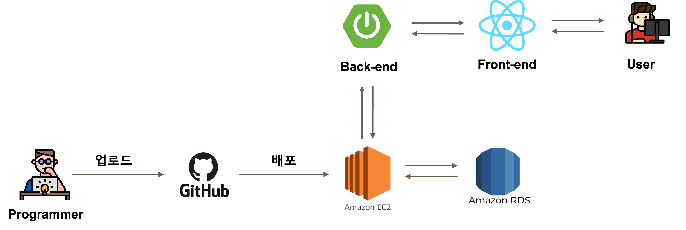

# 📚 CodeArena

> 2023 KB IT's Your Life 3기 최종 프로젝트 
> 친절한 프로그래밍 지식 설명과 재미있는 퀴즈 풀이까지, 코딩 교육 웹 플랫폼 codeArena
 

# 📌 Project & Members

> 진행기간: 2023. 05. 03 ~ 2023. 05. 31 (4주)

### 프로젝트 소개

IT's your life 3기, 과목 평가 준비에 많은 어려움을 겪는 동기들!
이를 대비하기 위해 과목 평가와 같은 형태의 퀴즈를 풀어볼 수 있는 **프로그래밍 기초 개념 사이트**가 있다면 어떨까?

- 지루할 틈이 없는 단체 퀴즈로 점수를 얻어 랭킹에 도전해보자! 

- 드래그만으로 chat GPT의 요약된 결과를 얻을 수 있다!

- 잘 모르겠어? 커뮤니티에서 토론의 장을 열어보자! 

 

### 프로젝트 구조

 

### 프로젝트 멤버

|||||| 
| -------------------------------------------- | ------------------------------------------ | ------------------------------------------------ |  ------------------------------------------ | ------------------------------------------------ |
| [이지은👑](https://github.com/Jieun714) | [김준서](https://github.com/adoo24) | [서은효](https://github.com/seoeunhyo) | [신선영](https://github.com/drsuneamer) | [조성환](https://github.com/Chos1) |
| - Word API  - 답안 제출 API  - 문제 전송 API  - 도메인 및 ACM 연결 | - 데이터베이스 설계  - JWT 토큰 인증 구현  - 실시간 게임 서비스   - 프로젝트 배포 | - 프로젝트 기획  - 커뮤니티 API  - 강의 및 퀴즈 데이터 제작  - 발표 자료 제작 | - UI 디자인  - 단어장 삭제 API  - 프로필 변경 API  - 전반적인 프론트엔드  | - 유저 API 및 문제 API  - 강의 내용 조회 API  - 단체퀴즈 프론트엔드  - 배너 제작, 영상 제작 | 

 

#  🤝 협업툴

    

 

# ⚙️ 기술 스택

### **Environment**
      

### **Front-End**
   

### **Back-End**
     

### **API**

 

# 🗒️ 기능 소개

### 0. 로그인/회원가입
* codeArena는 로그인 후 기능 사용 가능(회원제)
* 회원가입 시, 아이디와 닉네임 중복 여부 체크 

### 1. 기초 개념 강의
* Java, JSP&Servlet, Spring, DataBase, JavaScript, HTML/CSS 개념 강의 제공 

### 2. 단어 조회 및 저장
* '검색모드 on'을 한 후, 단어를 드래그하면 해당 단어에 해당하는 의미 확인 가능
* '내 단어장에 추가' 버튼 클릭 시, 자신의 단어장에 단어 추가 가능  

### 3. 문제 풀이
* 카테고리별 O/X, 객관식 퀴즈 제공
* 퀴즈를 처음 맞출 경우, 포인트 지급 

### 4. 커뮤니티
* 자유게시판, 질문게시판, 오류 제보 게시판 총 3개의 게시판
  * 게시물 및 댓글 작성, 삭제 가능  

### 5. 단체 퀴즈
* 카테고리 별 게임 방을 선택 가능
* codeArena 유저 랭킹 Top10을 확인 가능
* 단체퀴즈에서 게임 방에 입장한 사용자 간 채팅을 제공
    * 최대 4명의 플레이어가 같이 퀴즈 풀이 가능  

### 6. 마이페이지 및 프로필 변경
* 자신의 포인트와 티어, 현재 등수를 조회
* 자신이 맞은 문제와 틀린 문제를 확인
* 내 단어장을 통해 기초 개념 강의에서 저장한 단어를 확인 가능 

# ⚒️ 주요 기술력 소개
### ACM(AWS Certificate Manager)
* 웹 사이트 보완을 위해 AWS에서 제공하는 ACM을 사용하여, 기존 HTTP 환경에서 HTTPS 환경으로 변환.  
    

### JWT(Json Web Token)
* Client가 Server로 로그인 요청을 보내면 Client에게 JWT 토큰을 발급.  
* 만약 Client가 API를 통해 접근하게 되면 JWT토큰을 함께 전달하며, Server가 토큰을 검증한 후 Client에게 응답을 전송.   

   

### WebSocket
* 단체 퀴즈 기능에서 실시간 소통을 위해 socket 통신이 사용.  
* 게임방이 추가되거나 유저가 게임방을 나가는 등 방 정보에 변동 사항이 생긴다면, 서버에 전달. 서버가 해당 유저가 퀴즈를 진행할 때 서버에서 퀴즈가 전송되고, 유저는 서버로 퀴즈 정답을 전송.   

   

### OpenAI - GPT-3.5
* 유저가 단어를 검색하면 우선 DB로 접근하여 해당 단어가 DB에 있는지 유무를 판단.  
* 만약 DB에 존재한다면, 사용자에게 단어의 의미를 전송. 만약 존재하지 않는다면, ChatGPT에 단어의 의미를 요청.   

   

